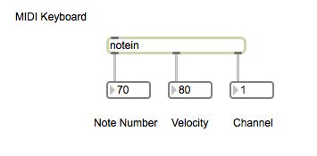
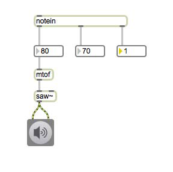
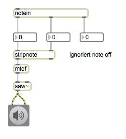
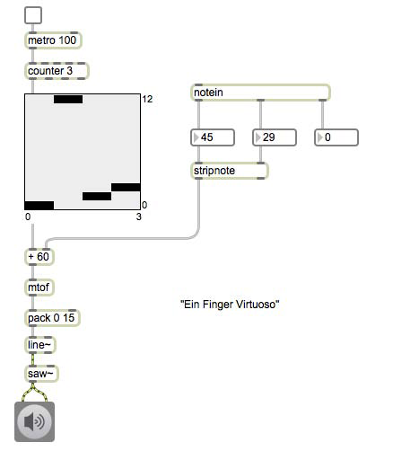
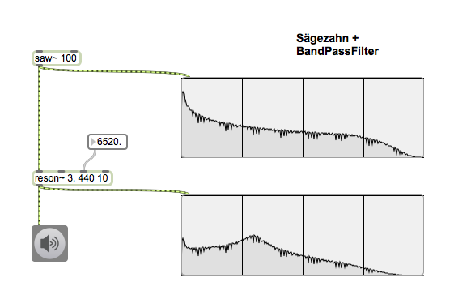
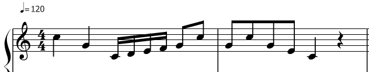

# Klasse1

## MIDI Keyboard

## Waveformsynthese
---

---

---

---

---
### Additivesynthese

---

---

---

---

---

### Subtraktivesynthese

---

---

---

### HA 

bis  Montag 20. April.
- Programmeiren Sie ein Patch, das die folgende Melodie mit Waveformsynthese spielt.
- Die melodie muss nach dem Öffnen des Patches *AUTOMATISCH* gespielt werden.

- Hinweis
	- iTable oder detonate, loadbang oder loadmess
	- ezdac~ akzeptiert 1 oder 0

