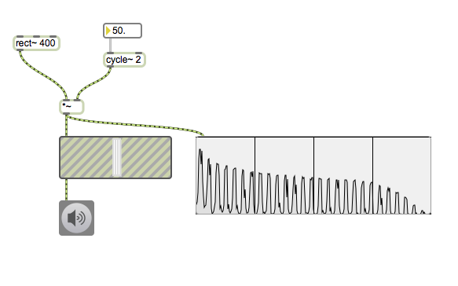
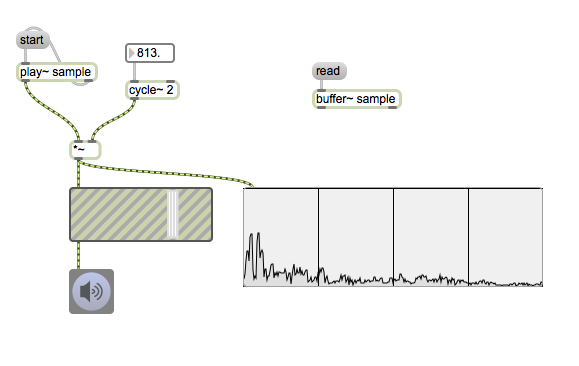

# Klasse2

## Modulationsynthese

### Ring Modulation

---
### Ring Modulation

---
### RM mit einem anderen Wellenform

---
### RM mit Samples

Beispielstück
		[Mantra](https://www.youtube.com/watch?v=3sylplEFxXo)
von K.Stockhausen

---

### Amplitude Modulation

---
### Amplitude Modulation

---

### Frequency Modulation

---
### Parallel Multiple Modulator Frequency Modulation

---
### Serial Multiple Mudulator Frequency Modulation

Beispielstück
[Stria](https://www.youtube.com/watch?v=988jPjs1gao)
von J.Chowning

## HA

Programmieren Sie ein Patch, das ein fest komponiertes Stück (20-30 Sekunden) oder ein generatives Stück mit FM-Synthese nach dem Öffnen des Patchs automatisch spielt. Sie müssen drei Parameter des FM-Synthese bzw. Trägerkreisfrequenz , Modulationskreisfrequenz und Modulationsindex mind. einmal im Stück verändern. 

Hinweis:
random, iTable, detonate, function, loadmess, metro und del

