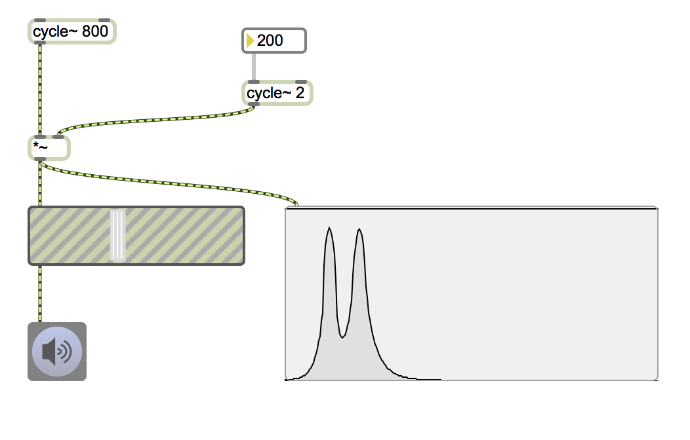
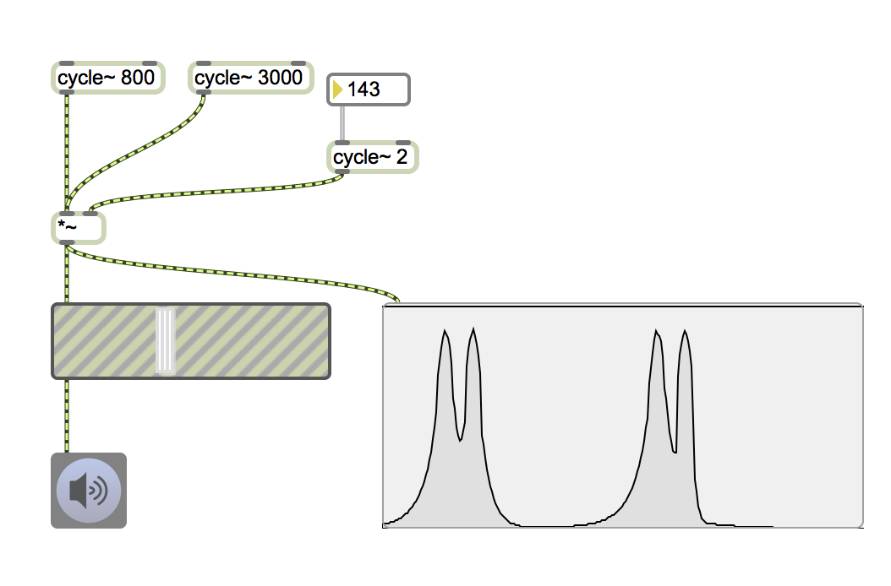
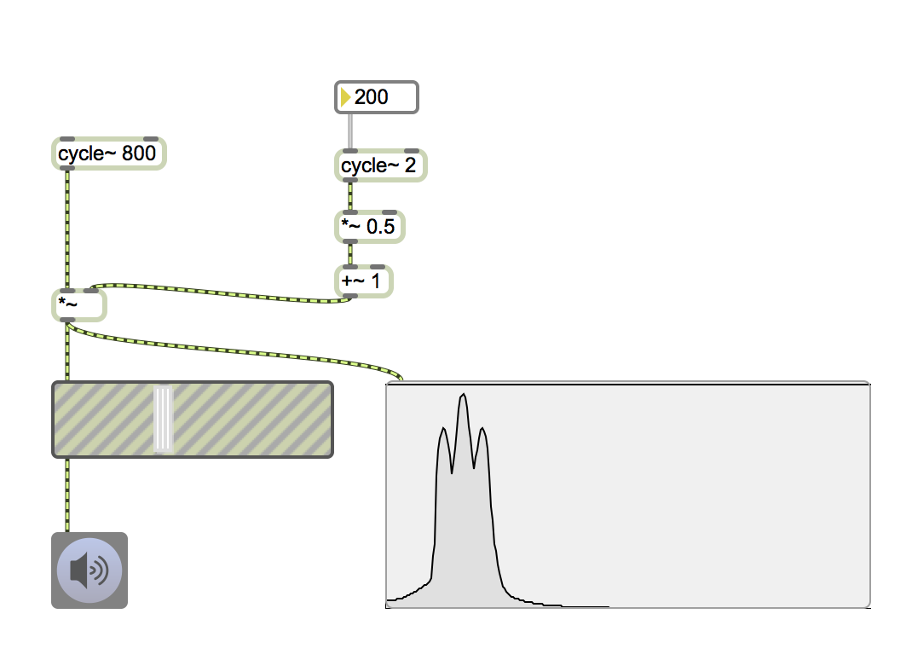
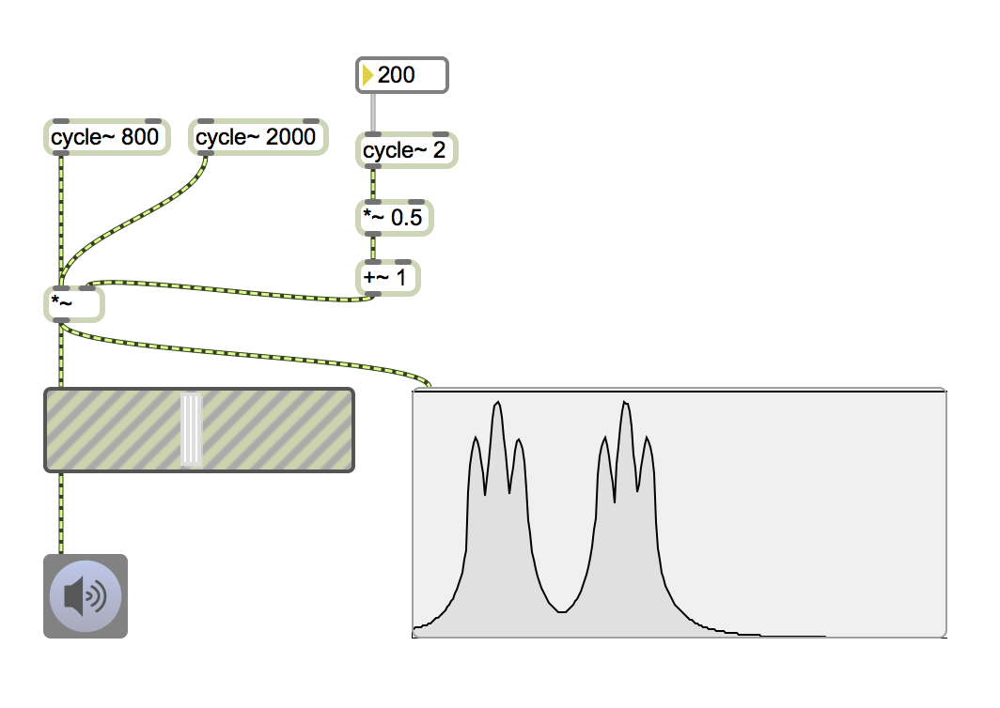
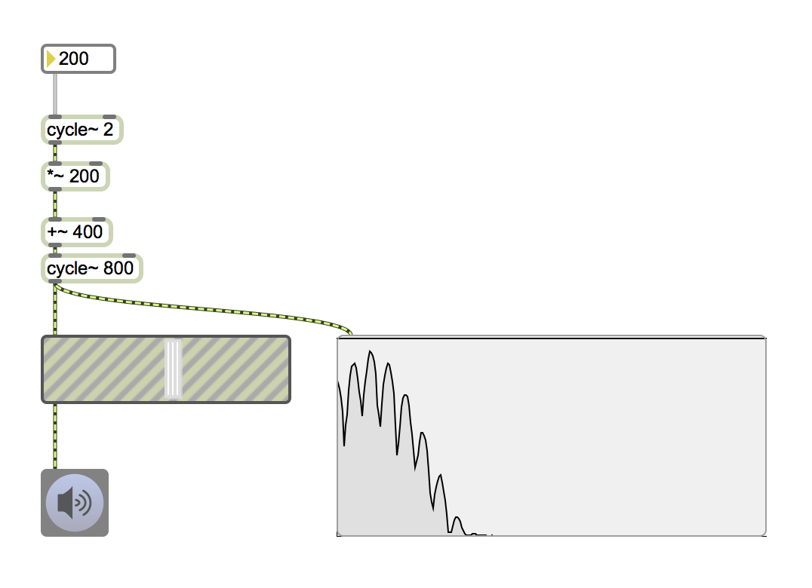
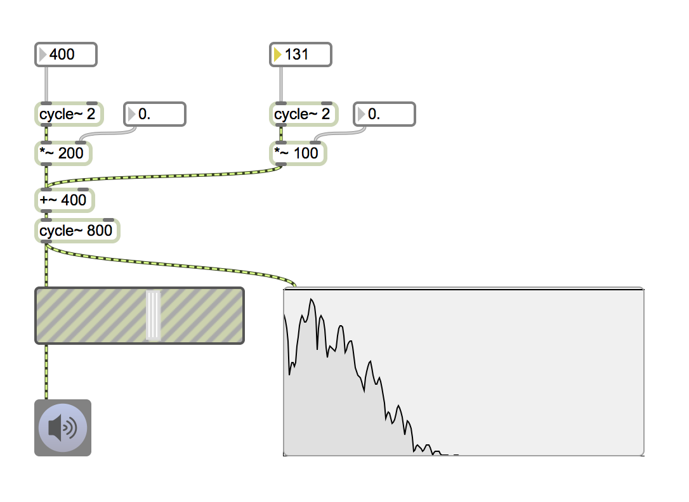
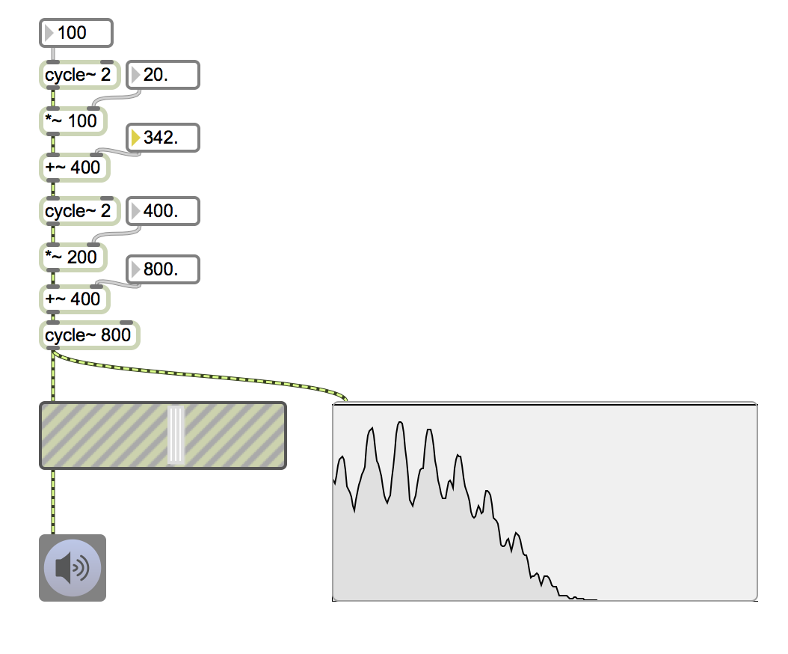

# Klasse2

## Polyphonischer Synthesizer

## Modulationsynthese

### Ring Modulation

---
### Ring Modulation

---
### Amplitude Modulation

---
### Amplitude Modulation

---
### Frequency Modulation

---
### Parallel Multiple Modulator Frequency Modulation

---
### Serial Multiple Mudulator Frequency Modulation

## Waveshaping synthese

## HA

Programmieren Sie ein Waveshping Polyphonic Synthesizer
