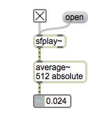
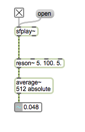
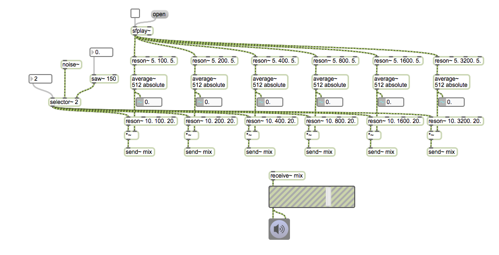

# Klasse5

## Karplus-Strong synthese

## Phase-Distortion-Synthese

## Waveshaping-Synthese

## HA.

1. Programmieren Sie ein Patch, das die folgende Melodie mit Karplus-Strong spielt.

### Vocoder
---

---

---

---

