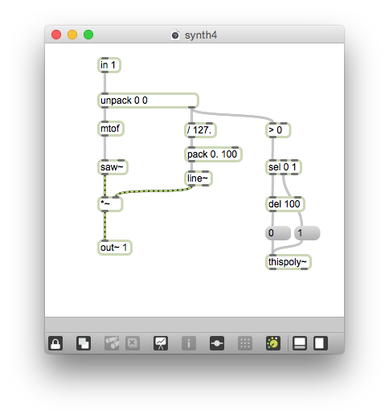
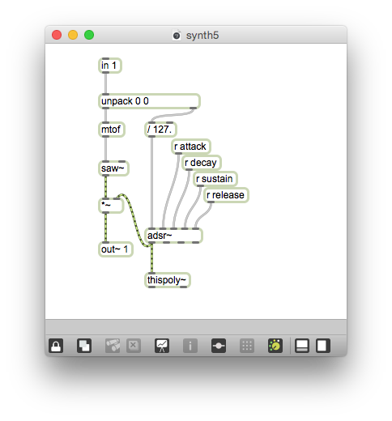
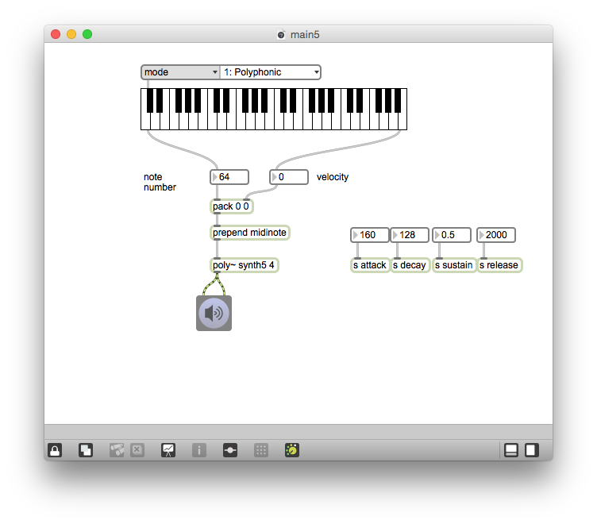

# Klasse5

### Polyphonie in Max

---

---

---

---

---

---

---

---

---

---

### HA

Programmieren Sie ein Patch, das die folgende MIDI-Datei mit FM-Synthese spielt. Benutzen Sie "poly~" "adsr~" und "detonate" für die Wiedergabe der Datei.

[MIDI File](Klasse5/mario.mid.zip)
[Detonate - Beispiel Patch](Klasse5/beispiel.zip)

 
