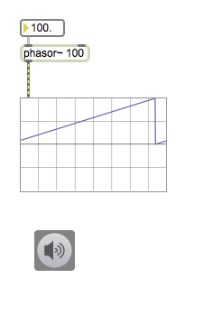
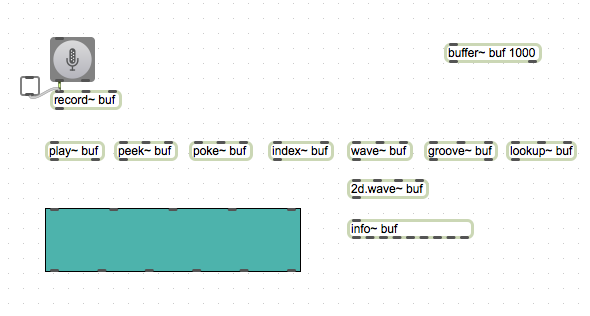
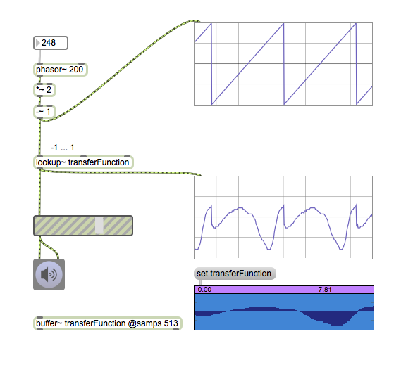
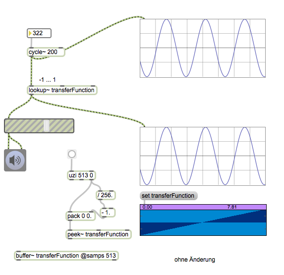
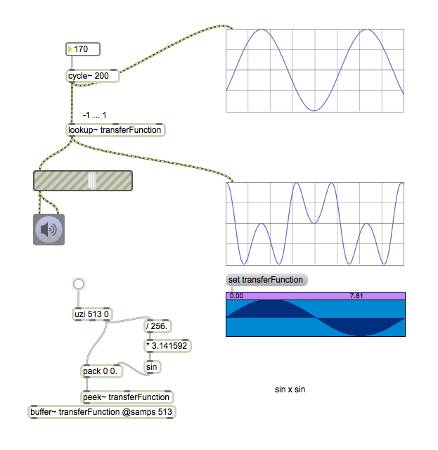
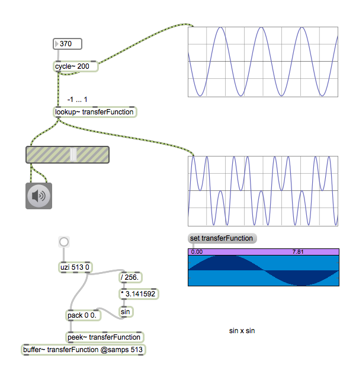
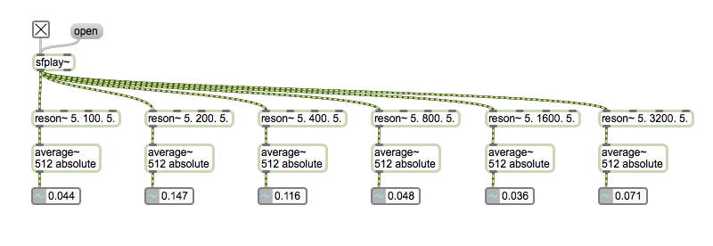

# Klasse7

## Karplus-Strong synthese

## Distortion-Synthese
### Phase-Distortion-Synthese

### Waveshaping-Synthese

---

---

---

---

### Vocoder
---

---

---

---

## HA

Programmieren Sie ein Patch, das die untenstehende Klangdatei und einem Pink-Rauschen mit einem Vocoder synthetisieren.

[Soundfile](Klasse7/spoken.wav.zip)

