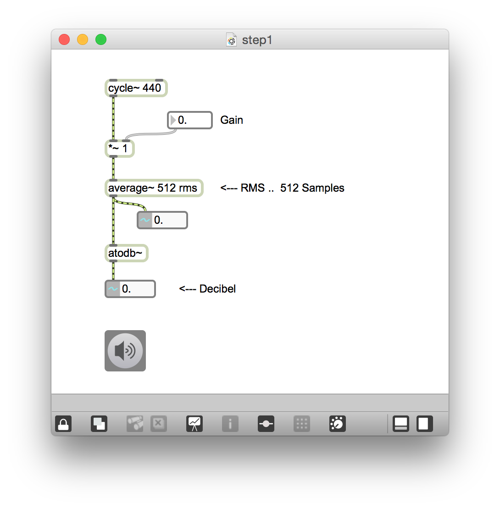
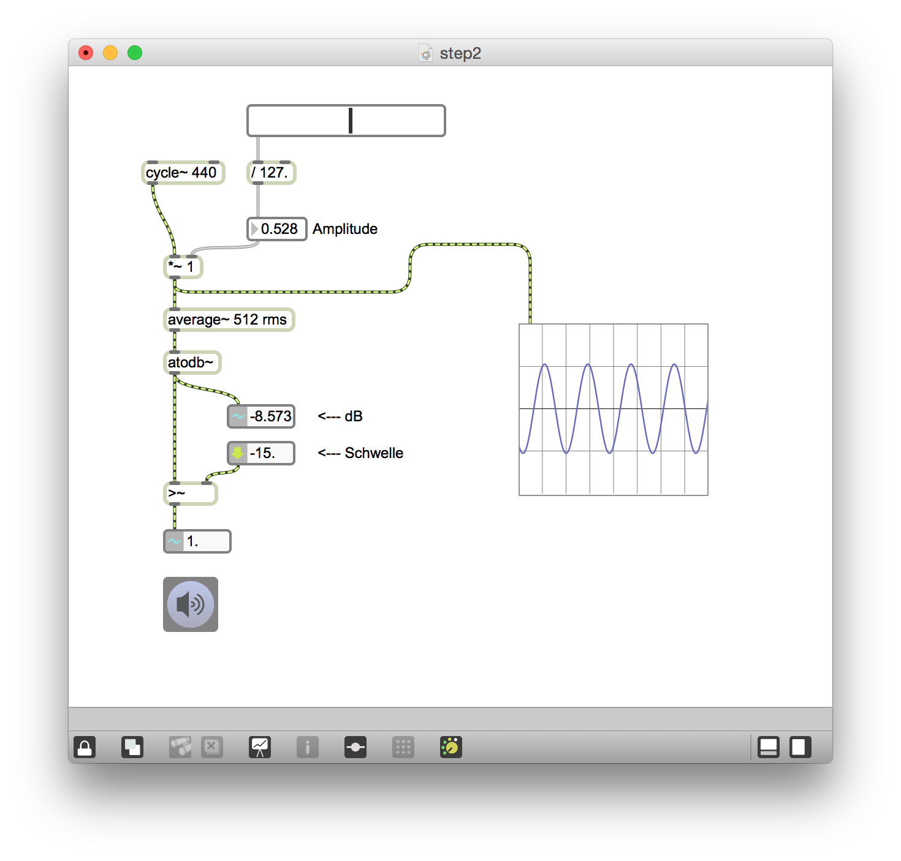
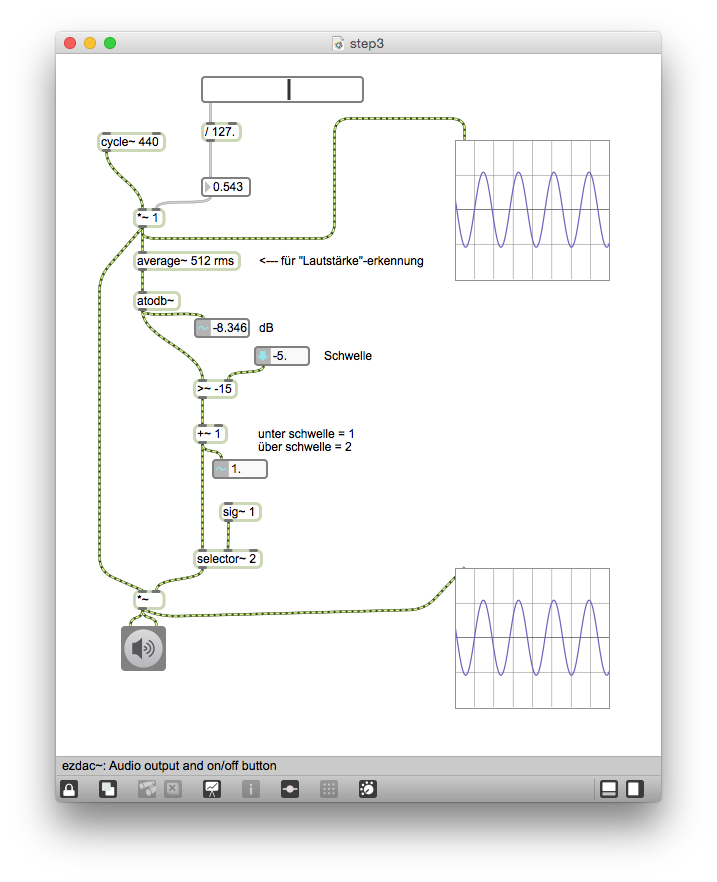
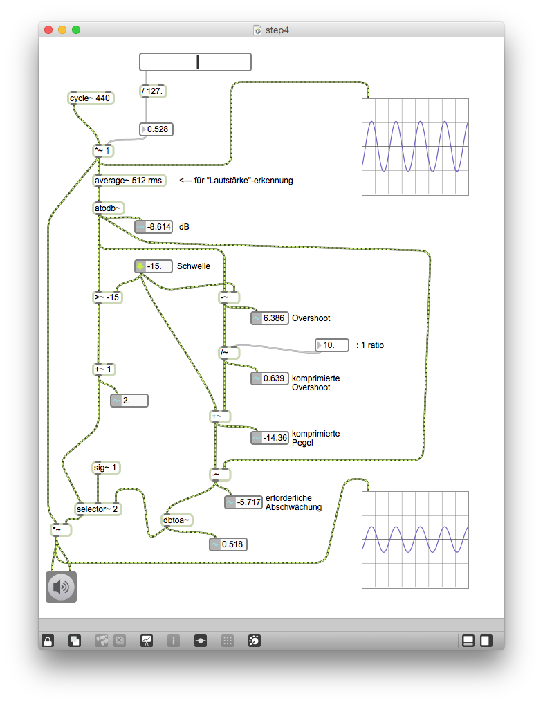
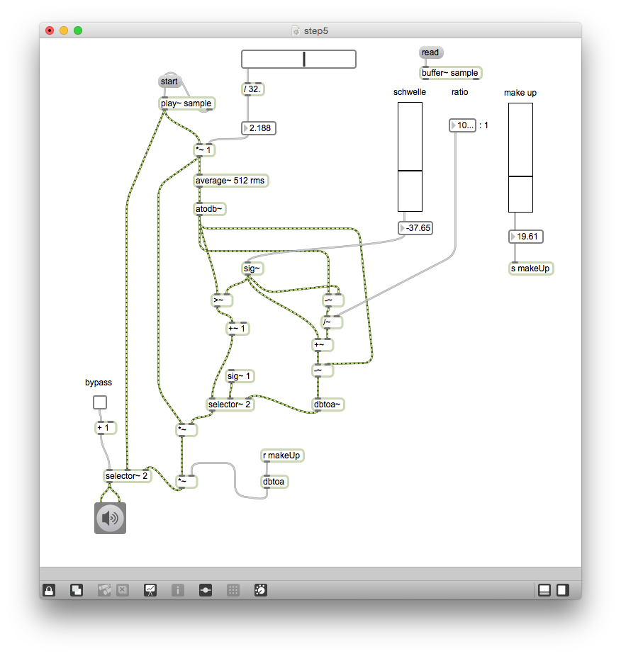
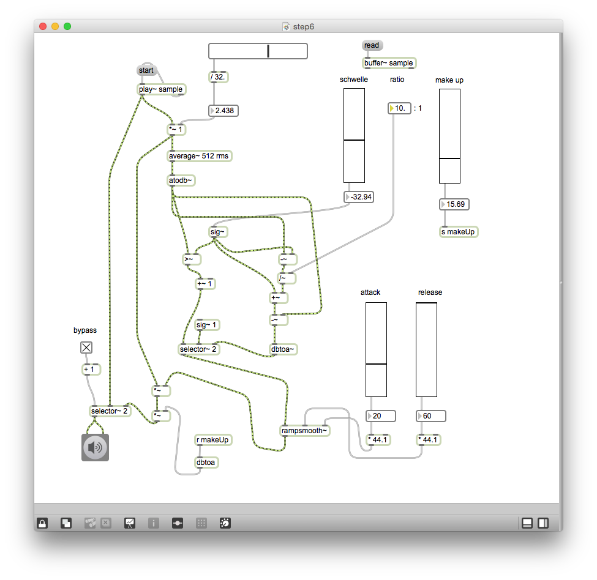
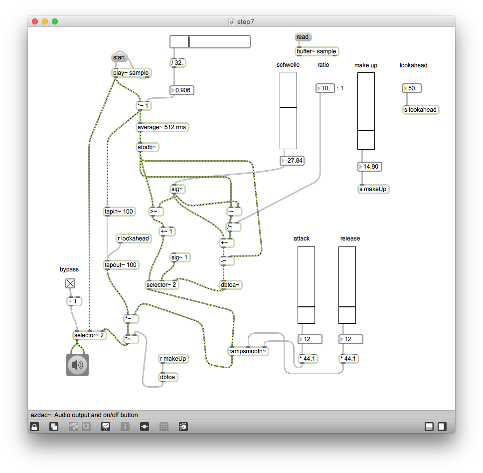
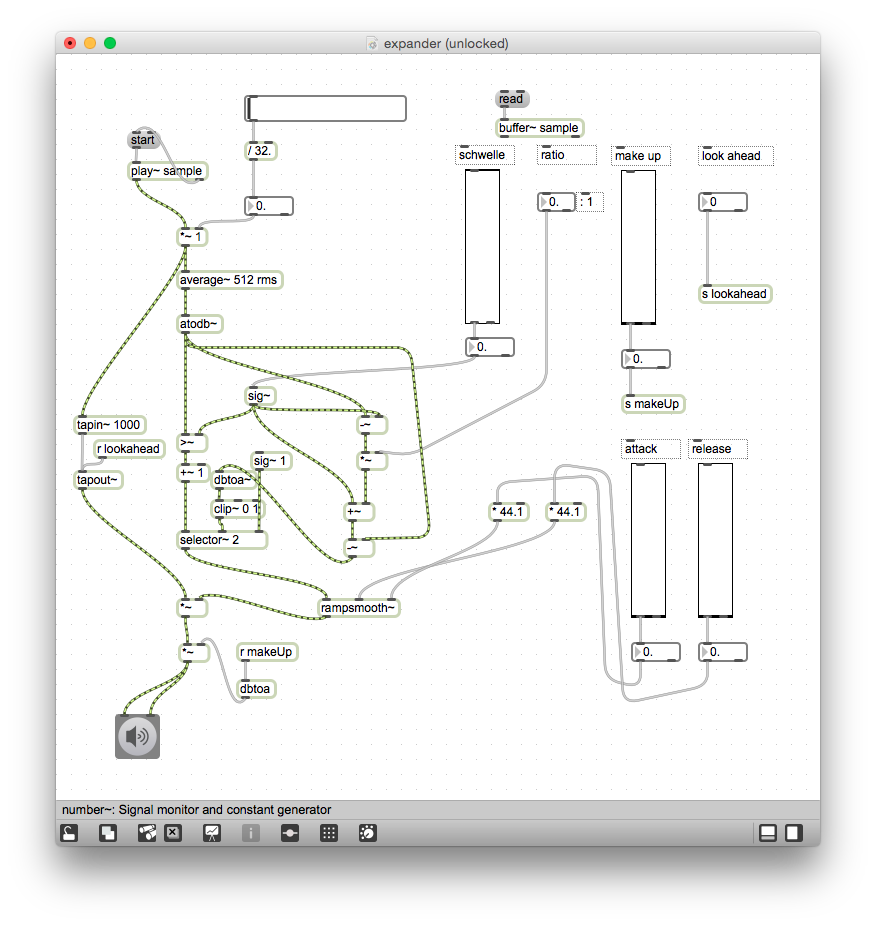

# Klasse8

### RMS

---
### Schwelle

---
### selector~

---
### Compressor

---
### Make Up und Bypass

---
### attack und release

---
### look ahead

---
###  Expander

### HA

Programmieren Sie einen Upward Kompressor