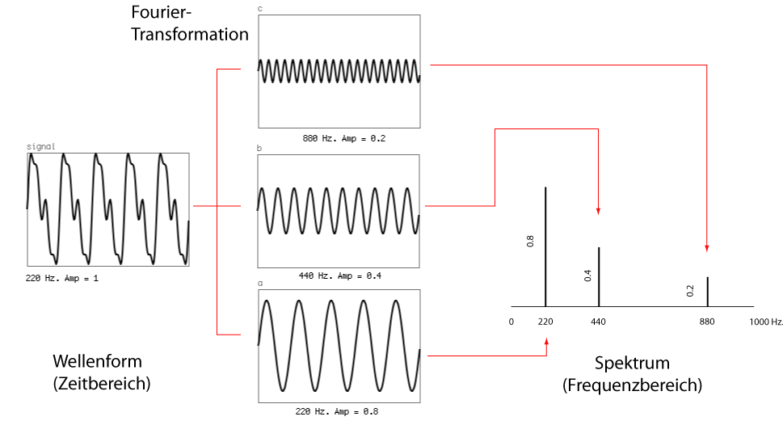
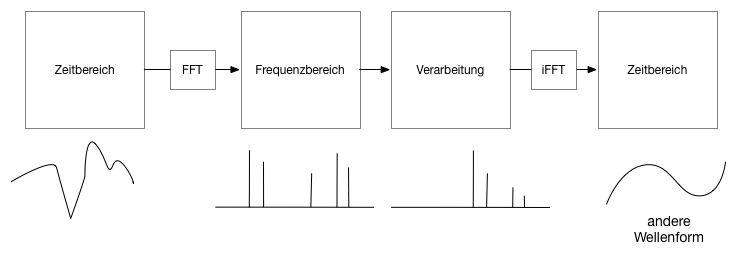
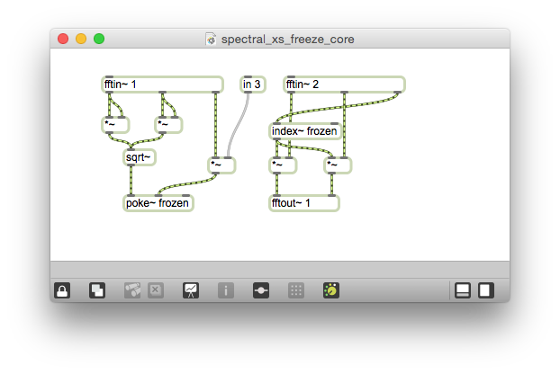
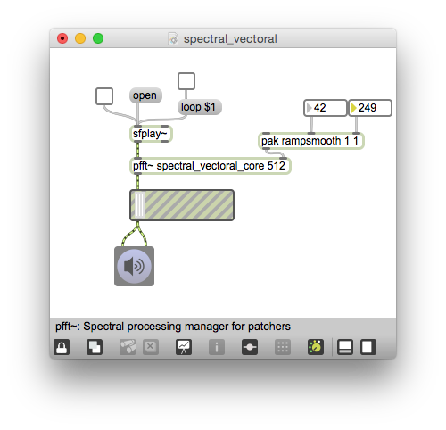

# Klasse9

### Joseph Fourier (1768 - 1830)

### FFT  (First Fourier Transformation)

### Spektrale Verarbeitung

### FFT1

---
### Core1

---
### FFT2

---
### Core2

---
### FFT3

---
### Core3

---
### Graphische EQ

---
### EQ Core

### Spectral Freeze

---

---

### Cross Synthesis

---

---
### Spectral Delay

---

---
### Spectral Reverb

---

---
